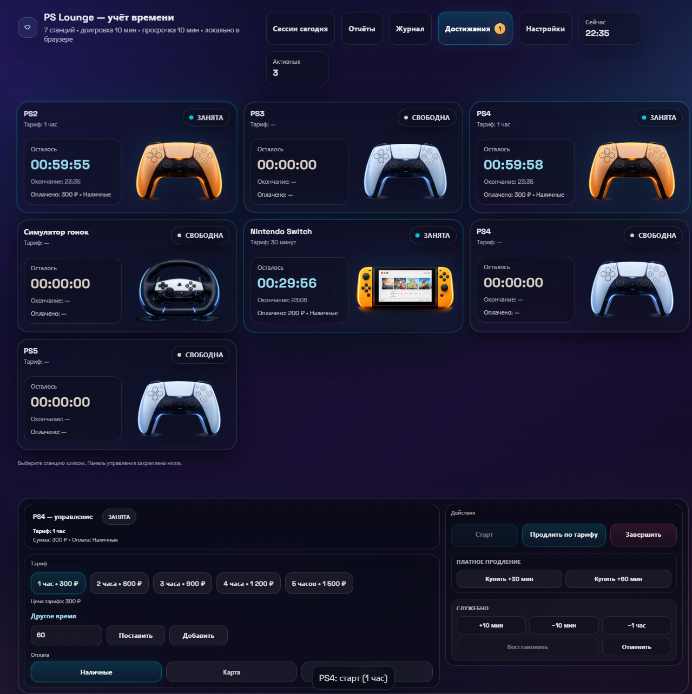
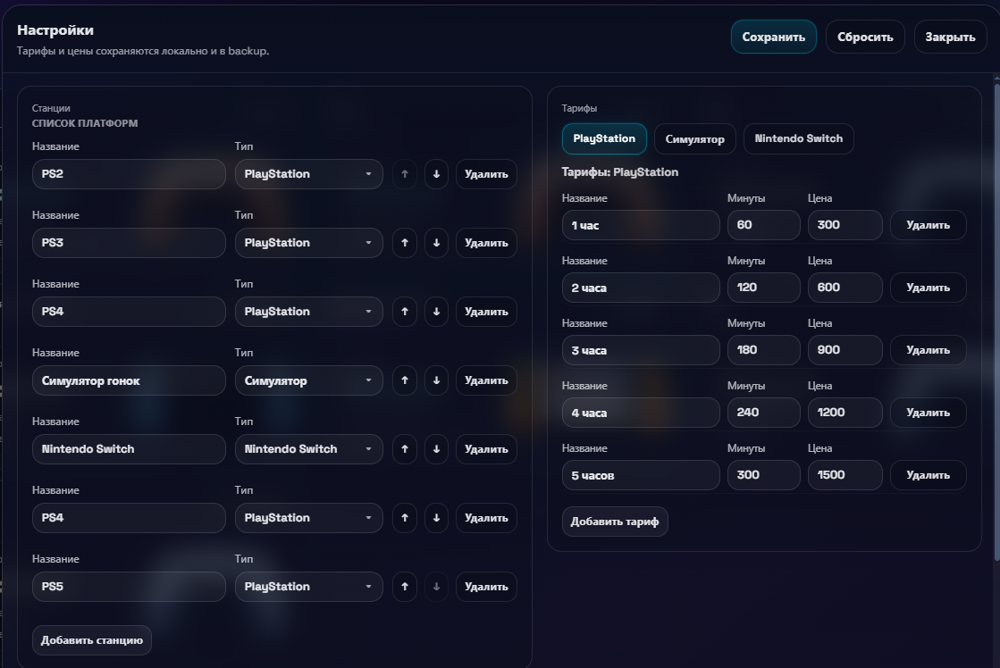
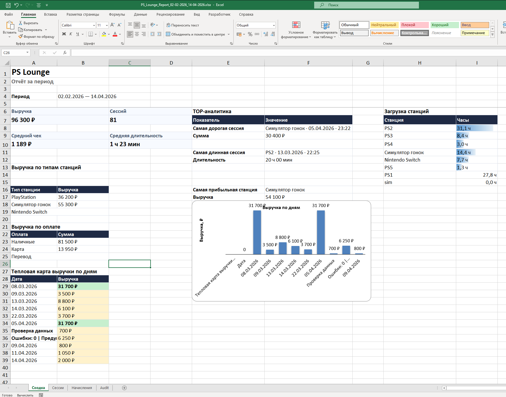
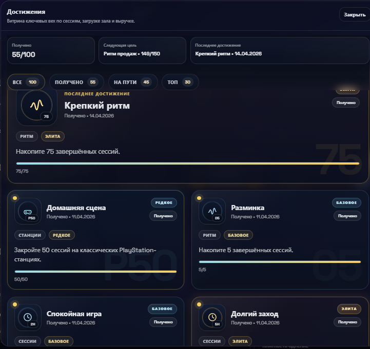

# PS Lounge 2.0

Локальное Windows-приложение для управления игровой площадкой: станции, сессии, оплаты, продления, отчёты и восстановление данных.

Проект появился как внутренний инструмент для «КонсольГрада» — команды, занимавшейся созданием игровых комнат под ключ. Вместо таблиц и ручных записей оператор получает единый экран текущей загрузки площадки и проверяемую финансовую историю смены.



## Что решает продукт

- показывает состояние каждой PlayStation, Nintendo Switch и гоночного симулятора;
- запускает, продлевает, завершает и восстанавливает игровые сессии;
- учитывает наличную, безналичную и смешанную оплату;
- хранит тарифы, состав и порядок станций в настраиваемой конфигурации;
- формирует отчёты за день или произвольный период;
- экспортирует XLSX с листами «Сводка», «Сессии», «Начисления» и `Audit`;
- ведёт журнал действий оператора;
- сохраняет резервные копии и историю снимков состояния;
- защищает настройки PIN-кодом;
- работает локально и не требует облачного сервиса.

## Версии

Обе рабочие версии находятся в одном репозитории и доступны через Git-теги.

| Версия | Содержание |
| --- | --- |
| `v1.0.0` | Исходный продукт: управление станциями, базовые сессии, локальное состояние и экспорт. |
| `v2.0.0` | Финансовый учёт, способы оплаты, платные продления, расширенные отчёты, журнал, настройки станций и тарифов, восстановление, backup/fallback, достижения и лицензирование. |

Ветка `main` всегда содержит актуальную версию.

## Интерфейс

| Настройки площадки | Отчёт XLSX |
| --- | --- |
|  |  |

### Достижения и операционные показатели



## Архитектура

```text
Vanilla JavaScript UI
        │
        ├── localStorage — оперативное состояние интерфейса
        │
        └── Flask API
              ├── проверка и резервирование состояния
              ├── восстановление primary / backup / snapshot
              ├── построение XLSX через openpyxl
              └── проверка локальной лицензии устройства
```

Основные решения:

- схема состояния версии 3 сохраняет совместимость со старыми данными;
- сервер повторно проверяет входящее состояние перед записью и экспортом;
- рабочие данные сохраняются локально, без внешней базы и передачи клиентских данных;
- офлайн-лицензия проверяется публичным ключом, а приватный ключ подписи не входит в репозиторий;
- PyInstaller собирает приложение в автономный Windows-пакет.

## Стек

- Python 3, Flask;
- JavaScript, HTML, CSS;
- openpyxl;
- PyInstaller;
- Playwright для локального UI smoke-теста;
- GitHub Actions для автоматических проверок.

## Локальный запуск

Требуется Python 3.10+.

```bat
run.bat
```

Скрипт создаст `.venv`, установит зависимости и откроет приложение по адресу `http://127.0.0.1:5000`.

## Проверки

```bat
setup_env.bat
tools\run_smoke_checks.bat
```

Набор проверок охватывает backend-маршруты, восстановление состояния, формирование XLSX, фильтры оплаты, порядок станций, достижения, лицензирование и основные UI-сценарии.

Тесты лицензирования требуют локального приватного тестового ключа и поэтому не выполняются в публичном CI. GitHub Actions запускает безопасную часть набора: синтаксис, backend smoke-тест и статические проверки бизнес-логики JavaScript.

## Сборка Windows-версии

```bat
build_exe.bat
```

Готовый пакет появится в `client_release\PS Lounge`.

## Безопасность данных

Репозиторий не содержит лицензий, приватных ключей, журналов, резервных копий, состояния реальной площадки и собранных исполняемых файлов. Все эти пути исключены через `.gitignore`.

## Статус

Версия 2.0 восстановлена, стабилизирована и проверена локальными smoke-тестами. Существующие маршруты экспорта и схема состояния сохранены для совместимости.

## Авторские права

Исходный код опубликован как портфолио. Условия использования указаны в [LICENSE](LICENSE).
